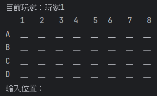
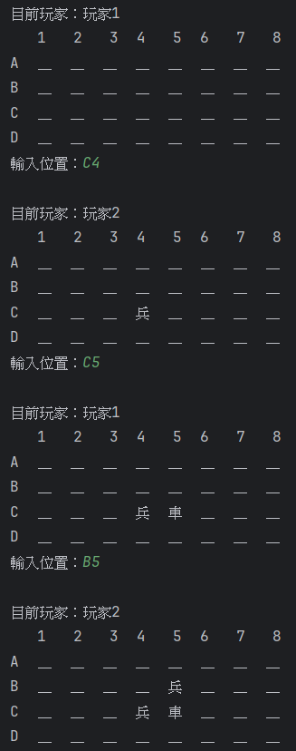
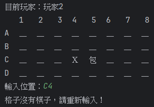
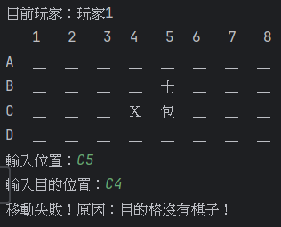
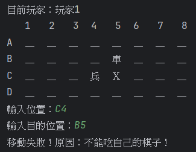
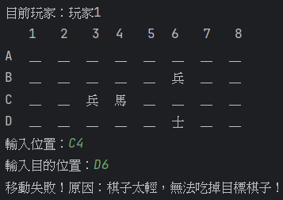

# H1 Report

* 姓名：陳稚翔
* 學號：D1249623

---

## 題目：象棋翻棋遊戲

---

## 設計方法概述

本程式實作一個簡單的象棋翻棋遊戲（4×8 棋盤，共 32 顆棋子），採用物件導向設計，主要包含以下類別：

### 1. AbstractGame（抽象類別）
定義遊戲基本行為：
- `setPlayers(Player, Player)`：設定玩家
- `move(int from, int to)`：移動棋子
- `gameOver()`：判斷遊戲是否結束

### 2. ChessGame（遊戲主體）
- 繼承 `AbstractGame`
- 負責棋盤初始化與隨機配置
- 控制遊戲流程（玩家輸入、翻棋、移動）
- 顯示棋盤與目前玩家

### 3. Chess（棋子類別）
- 屬性：
    - 名稱（name）
    - 權重（weight）
    - 陣營（side）
    - 位置（loc）
    - 是否翻開（revealed）
- `toString()`：控制棋子顯示（未翻開顯示「＿」）

### 4. Player（玩家類別）
- 紀錄玩家名稱與陣營

---

## 遊戲流程
1. 初始化棋盤（隨機排列 32 顆棋子）
2. 設定兩位玩家並決定先手
3. 玩家輪流操作：
    - 輸入位置（例如 A2）
    - 若棋子未翻開 → 翻開
    - 若棋子已翻開 → 輸入目的地進行移動或吃子
4. 每次操作後更新棋盤畫面
5. 當其中一方棋子全部被吃掉 → 遊戲結束

---

## 程式、執行畫面及其說明

### 主迴圈（控制遊戲進行）
此迴圈會持續執行直到遊戲結束，每次都會顯示棋盤並等待玩家輸入。
```java
while (!gameOver()) {
    showAllChess();
    System.out.print("輸入位置：");
    String input = sc.next();
}
```

### 玩家輪替機制
每當玩家成功翻棋或移動後，就會切換到另一位玩家。
```java
private void switchPlayer() {
    currentPlayer = (currentPlayer == p1) ? p2 : p1;
}
```

### 棋盤顯示範例
棋子名稱：已翻開  
＿：未翻開棋子  
Ｘ：沒有棋子的格子  

- 初始畫面  
  
- 吃掉一個棋子  
  

### 移動與吃子判斷
- 不可吃同一陣營棋子 
- 小棋子不能吃大棋子 
- 原格移走後顯示 Ｘ 
- 目的格必須有棋子，否則移動失敗
```java
    public String move(int from, int to) {
    Chess c1 = null, c2 = null;
    for (Chess c : board) {
        if (c.loc == from) c1 = c;
        if (c.loc == to) c2 = c;
    }
    
    ...
    
    // 標記原格 X
    XGrid[from] = true;

    // 吃掉目的格
    c2.captured = true;
    c2.loc = -1;

    // 移動棋子
    c1.loc = to;

    return ""; // 成功
}
```

### 移動與吃子判斷
每次移動失敗時會提示原因
- 格子沒有棋子，請重新輸入  
  
- 目的格沒有棋子  
  
- 目的棋子尚未翻開  
  
- 不能吃自己的棋子  
  
- 棋子太輕，無法吃掉目標棋子  
  
```java
public void play() {
    ...
    if (target == null) {
        System.out.println("格子沒有棋子，請重新輸入！");
        continue;
    }
    ...
    }
```
```java
public String move(int from, int to) {
    ...
    if (c2 == null) return "目的格沒有棋子！";
    if (!c2.revealed) return "目的棋子尚未翻開！";
    if (c1.side == c2.side) return "不能吃自己的棋子！";
    if (c1.weight < c2.weight) return "棋子太輕，無法吃掉目標棋子！";
    ...
}
```

## AI 使用狀況與心得
### 使用層級
層級 3：一開始就使用，搭配局部的自己撰寫。

### 與 AI 互動的次數與內容
本次作業過程中，大約與 AI 互動 10～15 次，主要內容包含：
- **程式架構設計**：建立 AbstractGame、ChessGame、Chess、Player 類別關係
- **功能實作**：棋盤顯示、翻棋邏輯、移動與吃子判斷
- **除錯**：修正陣列存取、位置轉換等問題
- **學習與理解**：詢問 OOP 設計方式與遊戲流程邏輯

### 使用 AI 的面向
- **除錯**  
  在程式執行錯誤或邏輯不正確時，透過 AI 協助快速找出問題。

- **學習**  
  透過 AI 解釋象棋規則，以及加深對 OOP 的理解。

### 手動完成（沒有使用 AI）的部分
- 加入玩家輪流機制、顯示目前玩家
- 報告撰寫與內容整理
- 調整輸出畫面（空格、被吃掉的棋子）
- 理解並測試程式執行流程

### 心得
AI 幫我快速建立完整程式架構，省下大量從零開始設計的時間，協助我理解原本不熟悉的象棋規則，減少除錯時間，但 AI 有時會給出不完全正確的答案，需要自行檢查與修改。我原本完全不會象棋，幸好有 AI 的幫忙，不然我自己看了很久的規則也看不太懂到底怎麼下象棋，我覺得 AI 是很好的工具，但是也不能完全依賴 AI 。